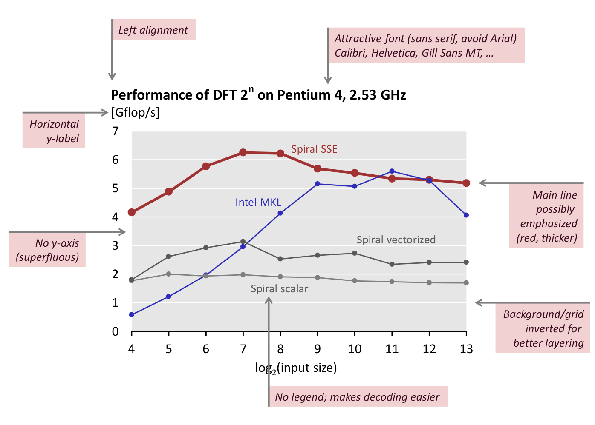

# Advancecd System Lab Project

## Changes

* Using BunchKaufman Linear solver instead of LU decomposition
* Change the matrix to 1d array
* Change `memove` to `memcpy`
* Batch evaluation (remove procedure call)
* evaluation and build(sharing of common subexpressions)
  * reuse `sqrt`
  * reuse index    

---------------

performance plot:
1a. evaluate surrogate - static replacement, remove dependency and unrolling;
1b. evaluate surrogate - vectorization; 

2. Bunchkaufman pivoting for symmetric indefinite matrix factorization; 
3. blocking - cache hit/ cache fit; 
   4a. static replacement, remove dependency and unrolling; 
   4b vectorization.

flops count of Bunchkaufman, evaluate surrogate, blocking. 

## Statistics

* performance plot (flops/cycle, Gflops/s) 横坐标 (dimension or iteration)

  

  * evaluate surrogate:
    * static replacement
    * remove dependency and unrolling
      * Execution units and ports & pipeline plot & dependency graph
    * vectorization
      * Vectorization plot
  * Bunchkaufman:
    * Flops count
    * blocking - cache hit/ cache fit
      * Microarchitecture
      * Cache miss analysis (lecture 08, P 32)
    * static replacement
    * remove dependency and unrolling
      * Execution units and ports & pipeline plot & dependency graph
    * vectorization.

* roofline plot

* operational intensity

* flags (-O2, -O3, -march=xxx, -mAVX, -m64, -fmath, RELEASE, -fno-alias, `#pragma ivdep`)

